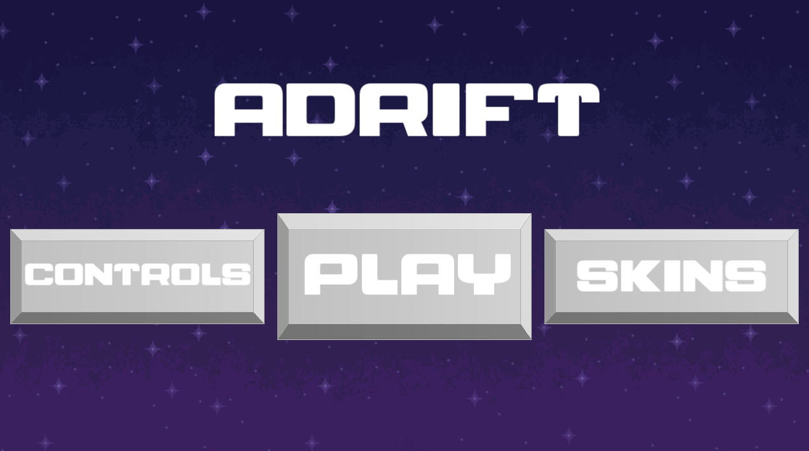
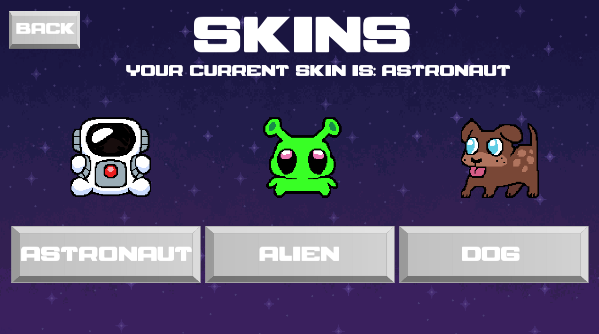

# Final Project CS151: Adrift

# Authors: Matthew Nolan, Isaiah Preston, Justin Rendon

## Project Description:

Our final project for CS151 is a game where the player must dodge obstacles and collect items to survive. The game's setting is outer space, with the obstacles being spaceships, asteroids, and UFOs. 

## How To Play:

### Installing The Game:

To run the game, use the command
```bash
make run
```

### Starting The Game:

When you open the game, you can either select the play button or press space to begin the game.


### Gameplay:

Dodge the obstacles (Spaceships, asteroids, UFOs). Your air will run out in 10 seconds, so collect air bubbles to stay alive.



Move up: W or up-arrow key
Move down: S or down-arrow key

### Changing Skins:

To change your characters skin, select the SKINS button. You can then select from 3 skin options. Your current skin will be indicated by the text above the skin options.
Select the back button to return to the main menu.


### Controls Menu:

To access the controls, select the CONTROLS button. You can then read the instructions for the game.
Select the back button to return to the main menu.


## What We Learned:

One of the most important things we learned during this project was how to use github to work on a project with others. We learned how branches and merge/pull requests work, and also learned how to resolve conflicts.

We learned the basics of a game loop and how to create a running application that has different screens. 

We learned how to troubleshoot logical errors in our code and how to map out a project with all of it's different pieces.

## What We Would Add With More Time: 

If we had more time, we would refactor a lot of our code to create more logical and testable functions. We found it difficult to find functions that could reasonably be tested with unit tests.

We would also want to have the air bubbles not displaying on top of the other obstacles, to add more animations for the sprites, and to have arcade style initials for your high score.

We got most of what we hoped to accomplish done.


